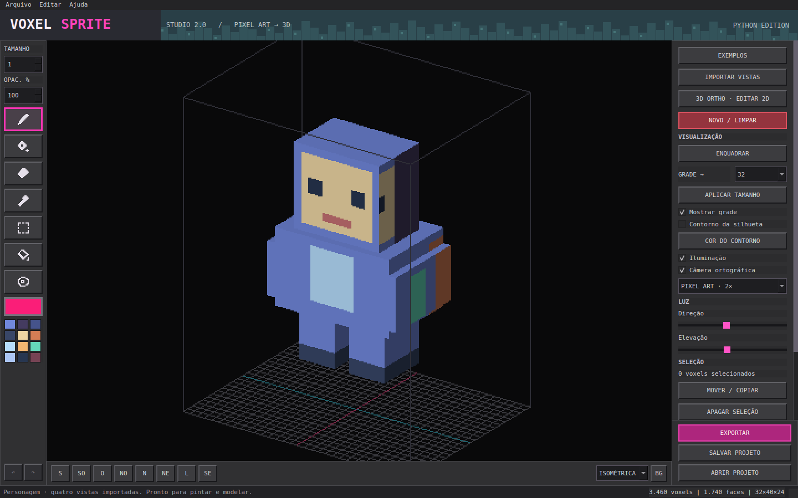

# VoxelSprite Studio 2.0

Editor desktop de voxels e pixel art 3D feito em Python. Crie modelos a partir de voxels ou reconstrua volumes usando imagens de até seis vistas ortográficas. Pinte as faces, edite projeções em 2D, salve projetos e exporte sprites e modelos.



## Recursos

- Edição de voxels com ferramentas de pintura, adição, remoção, seleção, balde e conta-gotas.
- Importação de vistas frontal, traseira, laterais, superior e inferior.
- Editor 2D para pintar as projeções ortográficas do modelo.
- Desfazer e refazer, seleção com mover/copiar e projetos salvos em JSON.
- Exportação para PNG, spritesheets, GIF, seis vistas ortográficas e OBJ/MTL.
- Exemplos incluídos para experimentar o aplicativo.

## Requisitos

- Windows 64 bits e Python 3.10–3.13.
- OpenGL 3.3 para a prévia 3D.
- Conexão com a internet na primeira execução para instalar as dependências.

## Executar no Windows

1. Instale o Python 64 bits e habilite **Add python.exe to PATH** durante a instalação.
2. Baixe ou clone este repositório.
3. Execute `iniciar_windows.bat`. O iniciador cria o ambiente virtual e instala as dependências na primeira execução.
4. No aplicativo, selecione **EXEMPLOS** para abrir um modelo de demonstração.

O iniciador não precisa de privilégios de administrador. O aplicativo é distribuído como código-fonte; não é um executável `.exe`.

## Desenvolvimento e testes

```shell
python -m venv .venv
```

No Windows:

```shell
.venv\Scripts\python -m pip install -r requirements.txt
.venv\Scripts\python main.py
.venv\Scripts\python -m unittest discover -s tests -v
```

No Linux/macOS:

```shell
.venv/bin/python -m pip install -r requirements.txt
.venv/bin/python main.py
.venv/bin/python -m unittest discover -s tests -v
```

No Linux, também são necessárias as bibliotecas de sistema do Qt/XCB e do OpenGL.

## Documentação

Consulte o [guia completo](LEIA-ME.md) para instruções de uso, atalhos, importação de imagens, exportação e solução de problemas. Consulte também [VALIDACAO.md](VALIDACAO.md) para detalhes sobre a validação do projeto.

Para entender a estrutura e a lógica do programa, consulte o [guia de leitura do código](GUIA_DO_CODIGO.md).

## Licença

Consulte o arquivo [LICENSE](LICENSE).
